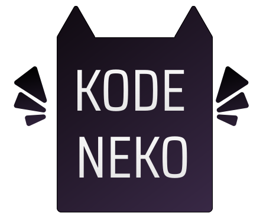
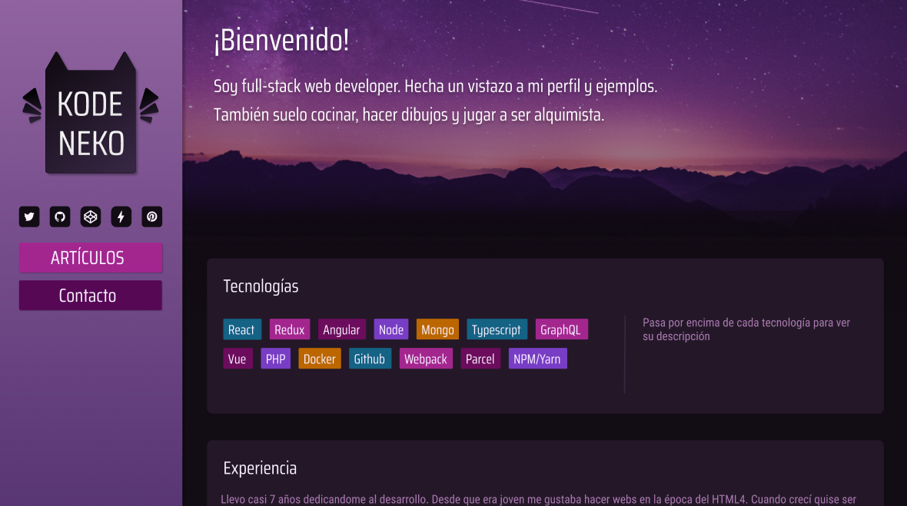

  

[💃 Personal Page](https://www.kodeneko.com) | [🐱 Github](https://github.com/kode-neko) | [🐤 Twitter](https://twitter.com/KodenekoFront) | [⚡ StackBlitz](https://stackblitz.com/@kode-neko) | [🧊 Codepen](https://codepen.io/kodeneko) | [🎨 Figma](https://www.figma.com/@kodeneko) | [✉️ Contact Mail](mailto:ladysun.freedom@gmail.com)

This is my personal web page 💻 I'm not so happy with the result. I think I could be done better but I learnt a lot 📖📚💡 I'm not very experienced with Vue.js and I don't like the its version 3 path. This project it's made by Options API instead of Composition one. 

The project may change over the time, so you could find changes the next time you check it out 😉

 

  

 

# 🔗 Links

This project connect to a small back-end. That is a very small project which provide basics functions such us mail redirection for contact forms ✉️

- [🖼️ This Personal page](https://www.kodeneko.com/lionmiss)
- [🏠 Back](https://www.kodeneko.com/lionmiss/swagger)

# ⚙️ Technologies
- [🛍️ Vue](https://vuejs.org/api/options-state.html)
- [🌳 Pinia](https://pinia.vuejs.org/)

# 🎨 Design
- [📱 UI | Mockup](https://www.figma.com/community/file/1233909940090440566)
